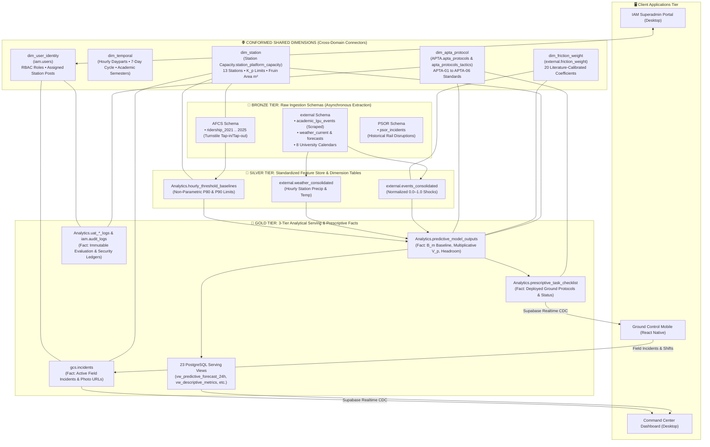
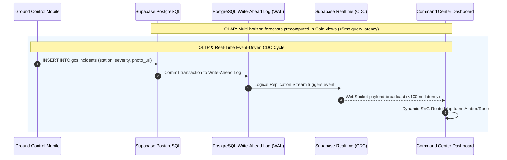

# LRT-2 Decision Support System — Database Architecture Specification

A formal technical specification documenting the database architecture, schema segregation, dimensional modeling, in-database transformation pipelines, and operational paradigms of the **LRT-2 Decision Support System (LRT2 DSS)**.

---

## 1. Executive Summary & Formal Taxonomy

### 1.1 Formal System Classification
In distributed data engineering, relational theory, and dimensional data warehousing (Kimball methodology), the database architecture of the LRT-2 Decision Support System is formally designated as:

> **Decoupled Multi-Domain Fact Constellation Architecture with In-Database Analytical Processing and Real-Time Event-Driven CDC**  
> *(Abbreviated: **Decoupled Fact Constellation HTAP Architecture**)*

### 1.2 Architectural Taxonomy Matrix

| Architectural Dimension | Academic & Engineering Classification | Implementation within LRT-2 DSS |
|---|---|---|
| **Dimensional Modeling** | **Fact Constellation Schema (Galaxy Schema)** | Multiple central fact tables (`AFCS.ridership_*`, `Analytics.predictive_model_outputs`, `external.events_consolidated`, `Analytics.prescriptive_task_checklist`, `gcs.incidents`, `Analytics.uat_*_logs`) intersecting across shared, conformed dimensions (`Station Capacity`, `APTA`, `external.friction_weight`, `iam.users`). |
| **Relational Boundary** | **Domain-Driven Decoupled Multi-Schema** | Complete segregation across eight dedicated PostgreSQL schemas (`AFCS`, `external`, `"Station Capacity"`, `PSOR`, `APTA`, `Analytics`, `gcs`, `iam`) with `0` tables in the default `public` schema. |
| **Workload Model** | **Hybrid Transactional / Analytical Processing (HTAP)** | Unifies high-throughput historical turnstile analytics and multi-horizon machine learning forecasts (OLAP) with sub-second field incident reporting, shift tracking, and task acknowledgments (OLTP). |
| **Data Lifecycle Progression** | **In-Database Medallion ELT Pipeline** | Three-tier data refinement model: Raw Asynchronous Ingestion (Bronze) $\rightarrow$ Standardized Feature Store (Silver) $\rightarrow$ 3-Tier Analytical Serving & Prescriptive Dispatch (Gold). |
| **Streaming & Reactive CDC** | **Event-Driven Change Data Capture (CDC)** | PostgreSQL Write-Ahead Log (WAL) logical replication via Supabase Realtime, streaming live updates over WebSockets in $<100\text{ ms}$ to desktop and mobile clients with zero client-side polling. |
| **Security & Governance** | **Zero-Trust Role-Based Access Control (RBAC) & Immutable Ledgers** | Granular PostgreSQL Row-Level Security (RLS) policies coupled with append-only audit ledgers (`iam.audit_logs`, `uat_*_logs`) where `UPDATE` and `DELETE` privileges are revoked. |

---

## 2. End-to-End Database Architecture Diagram



---

## 3. The 8 Core Domain Schemas in Detail

Rather than accumulating tables in PostgreSQL's default `public` schema, the system enforces **Domain-Driven Design (DDD)** by segregating data into eight isolated namespaces:

```
PostgreSQL Database Cluster (Supabase)
├── AFCS                 (Automated Fare Collection System Telemetry)
├── external             (Environmental, Weather, and Scraped Urban Bulletins)
├── Station Capacity     (Physical Architectural Blueprints & Fruin Limits)
├── PSOR                 (Historical Passenger Service Incident Logs)
├── APTA                 (Standardized Transit Operating Protocols)
├── Analytics            (3-Tier Decision Support Core & Feature Store)
├── gcs                  (Ground Control Subterranean Field Mobility)
└── iam                  (Identity Governance, RBAC, & Tamper-Resistant Audits)
```

### 3.1 `AFCS` (Automated Fare Collection System)
* **Domain Responsibility:** Ingestion and long-term persistence of empirical commuter demand transactions.
* **Core Base Tables:**
  * `ridership_2021`, `ridership_2021_backup`
  * `ridership_2022`, `ridership_2022_backup`
  * `ridership_2023`, `ridership_2023_backup`
  * `ridership_2024`, `ridership_2024_backup`
  * `ridership_2025`, `ridership_2025_backup`
* **Schema Mechanics:** Hourly entry and exit turnstile tap records partitioned by calendar year across all 13 LRT-2 stations. Acts as the immutable ground-truth dataset for training Tier 2 Machine Learning regression models ($B_m$).

### 3.2 `"Station Capacity"`
* **Domain Responsibility:** Physical infrastructure constants, spatial geometries, and capacity limits.
* **Core Base Tables:** `station_platform_capacity`, `station_platform_capacity_backup`.
* **Schema Mechanics:** Establishes station-level geometric and engineering baselines:
  * Platform area in square meters ($m^2$).
  * Physical passenger holding capacity limits ($K_p$).
  * Fruin Level-of-Service (LOS) standards:
    * **LOS D Warning ($P_{80}$):** $0.75\text{–}1.08 \text{ m}^2/\text{passenger}$
    * **LOS E/F Critical ($P_{90}$):** $<0.75 \text{ m}^2/\text{passenger}$
  * Powers real-time **Platform Capacity Utilization ($U_p$)**:
    $$U_p = \frac{V_p}{K_p} \times 100\%$$

### 3.3 `external` (External Environmental & Municipal Shocks)
* **Domain Responsibility:** Ingestion, tokenization, and consolidation of exogenous urban factors.
* **Core Base Tables:**
  * `academic_lgu_events`: Scraped unstructured announcements harvested by `python-source-layer` via Playwright and Gemini 2.0 Flash Vision OCR.
  * University Calendars: 8 institutional tables (`ADMU_`, `FEU_`, `PUP_`, `TIP_`, `UERM_`, `UE_`, `UPD_`, `UST_Academic_Calendar` + `processed_calendar_tables`) tracking semester breaks, exam weeks, and athletic events.
  * Weather Ingestion: `weather_current` (13 station feeds), `weather_forecasts` (7-day forecast), `weather_consolidated` (Open-Meteo & PAGASA precipitation and temperature).
  * `events_consolidated`: Normalized event table with categorical severity scoring ($0.0 \le S_k \le 1.0$) mapped by station node and timestamp.
  * `friction_weight`: 20 literature-calibrated friction coefficients ($W_k$) derived from UP NCTS, JICA, EASTS, and LRTA studies.

### 3.4 `PSOR` (Passenger Service Operating Requirements)
* **Domain Responsibility:** Historical transit operations telemetry and mechanical disruption logs.
* **Core Base Tables:** `psor_incidents`, `psor_incidents_backup`.
* **Schema Mechanics:** Catalogs historical signaling delays, catenary power outages, rolling stock defects, track maintenance intervals, and headway distortions for transit resilience research.

### 3.5 `APTA` (American Public Transportation Association)
* **Domain Responsibility:** Declarative codification of formal crowd-management standards.
* **Core Base Tables:** `apta_protocols`, `apta_protocols_backup`, `apta_protocols_tactics`.
* **Schema Mechanics:** Maps operating playbooks to standardized industry guidelines:
  * **APTA-01:** Normal Operations (Standard headway regulation and platform monitoring).
  * **APTA-02:** High Passenger Volume Warning ($U_p \ge 80\%$, $P_{80}$ non-parametric threshold).
  * **APTA-03:** Critical Platform Overcrowding ($U_p \ge 90\%$, $P_{90}$ threshold, platform metering).
  * **APTA-04:** Weather / Flash Flood Emergency Protocol.
  * **APTA-05:** Academic Influx / Mass University Event Protocol.
  * **APTA-06:** Technical Fault / Headway Distortion Protocol.
  * Granular tactics stored in `apta_protocols_tactics` (e.g., escalator direction reversal, turnstile throttling, barrier deployment, skip-stop train insertion).

### 3.6 `Analytics` (3-Tier Decision Support & Serving Core)
* **Domain Responsibility:** The computational and serving heart of the system.
* **Core Base Tables (14 Base Tables):**
  * `predictive_model_outputs`: 84,000+ hourly model outputs containing unperturbed baseline volume ($B_m$), elasticity adjustments ($V_p$), capacity headroom, and operational threat states.
  * `predictive_model_performance`, `predictive_model_performance_history`: Continuous tracking of regression and classification error metrics ($R^2$, RMSE, MAE, MAPE).
  * `predictive_passenger_volume_forecast_1y`: Multi-horizon precomputed forecasts (24h dayparts, 1-week, quarterly, 1-year).
  * `hourly_threshold_baselines`: Non-parametric statistical baselines ($P_{80}$ Warning and $P_{90}$ Critical) indexed by station, daypart, and day-of-week.
  * `prescriptive_protocol_deployments`, `prescriptive_task_checklist`, `prescriptive_valid_protocols`, `protocol_task_status`: Real-time operational dispatch queues.
  * `simulation_history`, `archived_simulation_history`: State persistence for controller What-If simulations.
  * `uat_predictive_evaluation_logs`, `uat_prescriptive_execution_logs`: Immutable time-series evaluation ledgers.
* **Serving Views (23 Views):**
  * *Descriptive Views:* `current_weather_feed`, `descriptive_live_event_feed`, `descriptive_historical_capacity_benchmarking`, `descriptive_historical_threshold_baselines`, `vw_descriptive_metrics`, `vw_hourly_actuals`.
  * *Predictive Views:* `predictive_passenger_volume_forecast_24h`, `1w`, `1m`, `quarterly`, `predictive_topological_route_map`, `predictive_known_events`, `vw_predictive_features`, `vw_kpi_prediction_accuracy`.
  * *Prescriptive Views:* `prescriptive_action_recommendations`, `prescriptive_active_checklists`, `prescriptive_compliance_audit`, `prescriptive_latency_summary`, `prescriptive_tactical_interventions`, `vw_uat_executive_summary`.

### 3.7 `gcs` (Ground Control System)
* **Domain Responsibility:** Subterranean field operations, station personnel shift rosters, and mobile incident reporting.
* **Core Base Tables:**
  * `shifts`: Station safety officer sign-in/out records, assigned station duty posts, and active rosters.
  * `incidents`: Field reports submitted from Ground Control Mobile (station, severity, category, resolution status, and Supabase Storage photo URLs).
  * `emergency_contacts`: Emergency directory for PNP transit units, medical teams, and station master control.

### 3.8 `iam` (Identity Access and Management)
* **Domain Responsibility:** Role-Based Access Control (RBAC), user authentication, and tamper-resistant security auditing.
* **Core Base Tables:**
  * `users`: Personnel accounts governed by strict role constraints:
    * `SAxxxx`: Super Admin (system provisioning, database migrations)
    * `POxxxx`: Provisioning Officer (staff onboarding, credential management)
    * `CCOxxxx`: Central Control Officer (Command Center Dashboard operations)
    * `GCSxxxx`: Ground Control Staff (Station mobile client operators)
  * `audit_logs`: Immutable, append-only security ledger capturing every login, credential update, role alteration, and prescriptive override.

---

## 4. Dimensional Modeling: The Fact Constellation (Galaxy Schema)

In classical dimensional modeling (Kimball methodology), transit systems cannot be effectively modeled with a single Star Schema because different operational business processes have distinct granularities and facts. 

The LRT-2 DSS utilizes a **Fact Constellation Schema**, where multiple independent fact tables intersect at shared **Conformed Dimensions**:

```
                              ┌──────────────────────────────────────────────┐
                              │                 CONFORMED                    │
                              │             dim_station (K_p)                │
                              └──────┬──────────────┬──────────────┬─────────┘
                                     │              │              │
             ┌───────────────────────┘              │              └────────────────────────┐
             ▼                                      ▼                                       ▼
┌─────────────────────────┐            ┌─────────────────────────┐            ┌─────────────────────────┐
│     FACT TABLE 1        │            │      FACT TABLE 2       │            │      FACT TABLE 3       │
│   fact_afcs_ridership   │            │   fact_predictive_model │            │   fact_field_incidents  │
│  (AFCS.ridership_202x)  │            │  (predictive_outputs)   │            │     (gcs.incidents)     │
└────────────┬────────────┘            └────────────┬────────────┘            └────────────┬────────────┘
             │                                      │                                       │
             │                ┌─────────────────────┴─────────────────────┐                 │
             └───────────────►│                CONFORMED                  │◄────────────────┘
                              │            dim_temporal_time              │
                              └─────────────────────┬─────────────────────┘
                                                    │
                                                    ▼
                                       ┌─────────────────────────┐
                                       │      FACT TABLE 4       │
                                       │ fact_prescriptive_tasks │
                                       │ (task_checklist/deploy) │
                                       └────────────┬────────────┘
                                                    │
                               ┌────────────────────┴────────────────────┐
                               ▼                                         ▼
                 ┌───────────────────────────┐             ┌───────────────────────────┐
                 │         CONFORMED         │             │         CONFORMED         │
                 │     dim_apta_protocol     │             │       dim_user (RBAC)     │
                 │   (APTA.apta_protocols)   │             │        (iam.users)        │
                 └───────────────────────────┘             └───────────────────────────┘
```

### 4.1 Conformed Dimension Matrix

| Conformed Dimension Table | Underlying Schema & Table | Shared Across Fact Tables |
|---|---|---|
| **`dim_station`** | `"Station Capacity".station_platform_capacity` | `AFCS.ridership_*`, `Analytics.predictive_model_outputs`, `external.events_consolidated`, `gcs.incidents`, `Analytics.prescriptive_task_checklist` |
| **`dim_temporal`** | Time Dimension (Daypart, Day-of-Week, Academic Calendar) | `AFCS.ridership_*`, `Analytics.predictive_model_outputs`, `external.weather_consolidated`, `Analytics.hourly_threshold_baselines` |
| **`dim_apta_protocol`** | `APTA.apta_protocols` & `apta_protocols_tactics` | `Analytics.predictive_model_outputs`, `Analytics.prescriptive_task_checklist`, `Analytics.uat_prescriptive_execution_logs` |
| **`dim_friction_weight`** | `external.friction_weight` | `external.events_consolidated`, `external.weather_consolidated`, `Analytics.predictive_model_outputs` |
| **`dim_user`** | `iam.users` | `gcs.shifts`, `gcs.incidents`, `iam.audit_logs`, `Analytics.prescriptive_task_checklist` |

---

## 5. In-Database Medallion ELT Data Progression

Rather than relying on high-latency external ETL orchestrators that serialize data across network boundaries, all transformations execute directly adjacent to the storage layer in PostgreSQL using procedural `PL/pgSQL` routines.

```
┌────────────────────────────────┐       ┌────────────────────────────────┐       ┌────────────────────────────────┐
│        🥉 BRONZE TIER          │       │        🥈 SILVER TIER          │       │         🥇 GOLD TIER           │
│     Raw Ingestion Sink         │ ────► │   Standardized Feature Store   │ ────► │ 3-Tier Analytical Serving Facts│
├────────────────────────────────┤       ├────────────────────────────────┤       ├────────────────────────────────┤
│ • Scraped Facebook posts       │       │ • events_consolidated          │       │ • 24h, 1w, 1y volume forecasts │
│ • Raw weather JSON bulletins   │       │ • weather_consolidated         │       │ • APTA active checklists       │
│ • Raw turnstile workbooks      │       │ • hourly_threshold_baselines   │       │ • 23 Dashboard serving views   │
│ • PSOR incident logs           │       │ • 20 calibrated weights        │       │ • Immutable audit ledgers      │
└────────────────────────────────┘       └────────────────────────────────┘       └────────────────────────────────┘
```

1. **Bronze Tier (Raw Ingestion):**
   * Apify cloud actors and serverless GitHub Actions ingest external announcements and weather feeds into `external.academic_lgu_events` and `external.weather_current`.
   * Unprocessed turnstile transaction logs are loaded into `AFCS.ridership_*`.
2. **Silver Tier (Standardization & Feature Engineering):**
   * Stored procedures clean, normalize, and score event severity ($0.0 \le S_k \le 1.0$), outputting to `external.events_consolidated`.
   * The Descriptive Analytics engine computes the non-parametric percentile baselines ($P_{80}$ Warning, $P_{90}$ Critical) and Commuter Friction Index ($CFI$), persisting them in `Analytics.hourly_threshold_baselines`.
3. **Gold Tier (Analytical Serving & Operational Dispatch):**
   * Tier 2 Machine Learning models produce baseline volume $B_m$ and apply multiplicative elasticity shocks to calculate adjusted passenger volumes $V_p$ in `Analytics.predictive_model_outputs`.
   * Prescriptive decision trees automatically populate `Analytics.prescriptive_task_checklist` with standardized APTA crowd directives.
   * 23 pre-indexed PostgreSQL views serve mission-control queries in $<5\text{ ms}$.

---

## 6. Hybrid Transactional / Analytical Processing (HTAP) & Event-Driven CDC

The LRT-2 DSS resolves the fundamental tension between high-throughput analytical reads (OLAP) and concurrent low-latency operational writes (OLTP):



1. **Analytical Processing (OLAP):** Long-range forecasts, 24-hour daypart timelines, and What-If scenario simulations run on pre-indexed analytical tables and optimized views without acquiring exclusive table locks.
2. **Transactional Processing (OLTP):** Station safety marshals continuously log incident reports, acknowledge task checklists, and update shift rosters via mobile clients.
3. **Zero-Polling Real-Time Synchronization (CDC):** When mutations commit to PostgreSQL, Supabase Realtime reads the transaction directly from the Write-Ahead Log (WAL) and broadcasts WebSocket payloads to all active desktop consoles and mobile clients in $<100\text{ ms}$.

---

## 7. Security, Governance, and Immutability Matrix

| Security Layer | Implementation Mechanism | Enforcement Boundary | Operational Protection |
|---|---|---|---|
| **Role-Based Access Control (RBAC)** | Cryptographic JWT claims verified via `iam.users` | API Gateway & Application Route Guards | Restricts actions based on identity tiers (`SAxxxx`, `POxxxx`, `CCOxxxx`, `GCSxxxx`). |
| **Row-Level Security (RLS)** | Declarative PostgreSQL RLS Policies | Database Engine Kernel | Ensures ground personnel can only view and mutate tasks/incidents belonging to their assigned station. |
| **Administrative Audit Ledger** | Append-only `iam.audit_logs` | Revoked `UPDATE` and `DELETE` PostgreSQL privileges | Guarantees tamper-resistant records of user logins, role modifications, and operational overrides. |
| **Prescriptive Evaluation Ledgers** | `uat_predictive_evaluation_logs` & `uat_prescriptive_execution_logs` | Append-only database triggers on 30-min cron cadence | Logs algorithm precision, System Compliance Ratio (SCR), and end-to-end delivery latency for institutional compliance. |
| **Field Evidence Storage** | S3-compatible Supabase Storage (`incident-photos`) | Bucket RLS & Encrypted Signed URLs | Prevents public exposure of sensitive operational incident photos. |

---

## 8. Academic Citation & Theoretical Synthesis

This database architecture is grounded in established data engineering literature and municipal transit standards:

1. **Kimball, R., & Ross, M. (2013).** *The Data Warehouse Toolkit: The Definitive Guide to Dimensional Modeling* (3rd ed.). John Wiley & Sons.  
   *(Foundational theory for Fact Constellation / Galaxy Schema and Conformed Dimensions).*
2. **Ruíz-Ceniceros, A. (2024).** *Relational database architectures in modern web applications: Comparing PostgreSQL, Row-Level Security, and cloud database engines*. International Journal of Computer Science and Information Security, 22(5), 78–89.  
   *(Theoretical justification for schema-level isolation, in-database transformations, and PostgreSQL Row-Level Security).*
3. **American Public Transportation Association (APTA) (2021).** *Operating Practices for Transit Crowd and Capacity Management* (APTA RT-OP-S-002-09). APTA Standards Development Program.  
   *(Standardized crowd-management baseline operationalized within `APTA.apta_protocols`).*
4. **Transportation Research Board (TRB) (2023).** *Transit Capacity and Quality of Service Manual (TCQSM)* (TCRP Report 165 Supplement). National Academies of Sciences, Engineering, and Medicine.  
   *(Establishes Level of Service D/E/F crowd density thresholds operationalized in `"Station Capacity".station_platform_capacity`).*
