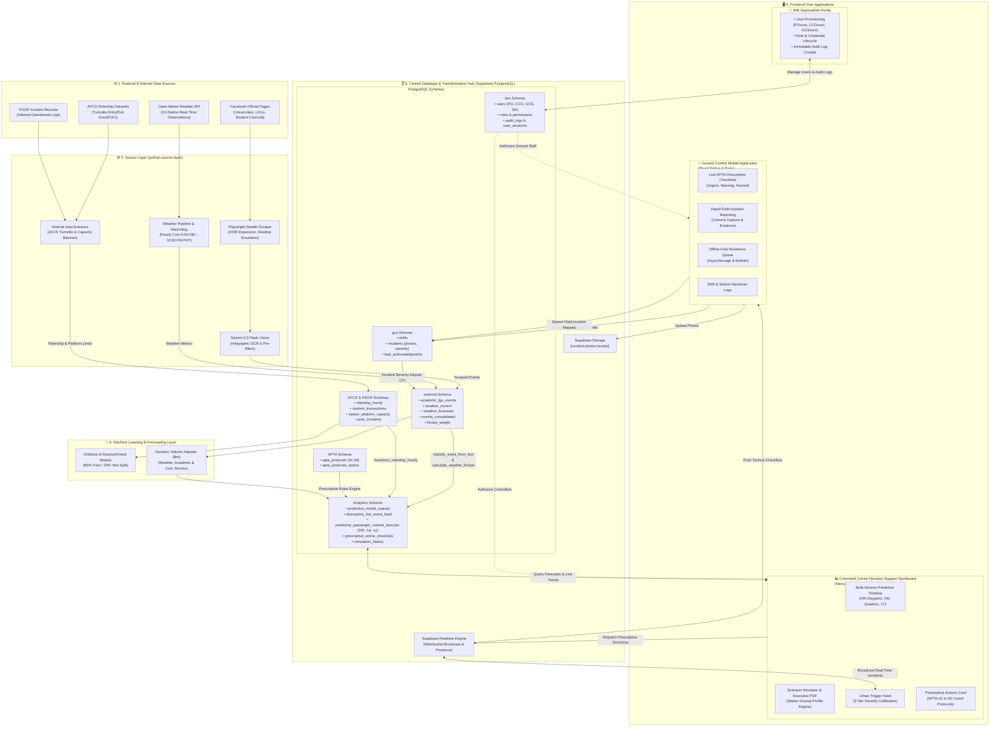
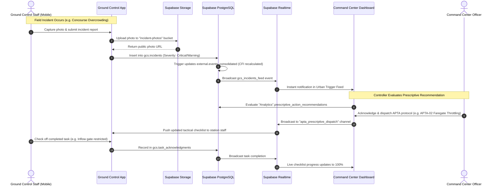
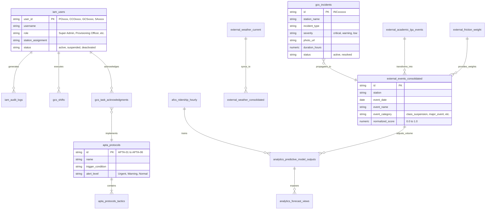

# LRT-2 Decision Support System — High-Level System Architecture

A comprehensive architectural specification documenting the end-to-end topology, data flow pipelines, database schemas, and operational feedback loops across all five sub-applications in the LRT-2 Commuter Friction & Decision Support ecosystem.

---

## 1. End-to-End System Architecture Diagram

---

## 2. Sub-Application Breakdown & Responsibilities

| Sub-Application | Path | Primary Tech Stack | Core Responsibilities |
|---|---|---|---|
| **1. Source Layer** | `Scraper/` (`python-source-layer`) | Python 3.12, Playwright, BeautifulSoup, Gemini 2.0 Flash | • Scrapes official Facebook academic/LGU announcements. • Extracts text from advisory infographics via Gemini Vision OCR. • Fetches hourly Open-Meteo weather observations and 7-day forecasts. • Executes internal AFCS turnstile ETL batches. |
| **2. Transformation & ML Layer** | `Analytics/` (`supabase_analytics_layer`) | PostgreSQL PL/pgSQL, Python 3.10, XGBoost, Scikit-learn | • Standardizes raw inputs into the Commuter Friction Index (CFI). • Runs classification functions (`classify_event_from_text`). • Trains volume prediction models ($B_m$) and computes headroom. • Compiles prescriptive crowd-control checklists against APTA standards. |
| **3. Decision Support Dashboard** | `Command Center Dashboard/` | Next.js 16.2, Electron 31, TailwindCSS, Recharts | • Mission-control interface for transit controllers. • Visualizes 24h, 1w, quarterly, and 1y predictive passenger volumes. • Runs what-if simulations with realistic diurnal curves. • Exports printable A4 executive PDF reports. • Dispatches APTA crowd management checklists. |
| **4. Ground Control Mobile** | `Ground Control Mobile/` | React Native 0.81, Expo 54, NativeWind | • Field client for station safety officers and platform personnel. • Displays prioritized real-time APTA checklists (Urgent / Warning / Normal). • Enables rapid incident reporting with camera evidence capture. • Provides offline mutation queuing (`useOfflineSync`). |
| **5. IAM Superadmin Portal** | `Identity Access and Management Portal/` | Next.js 16.2, Electron, TailwindCSS, Radix UI | • Single source of truth for user authentication and authorization. • Enforces Role-Based Access Control (`SAxxxx`, `POxxxx`, `CCOxxxx`, `GCSxxxx`). • Immutably records administrative actions in `iam.audit_logs`. |

---

## 3. Detailed Data Flow & Operational Feedback Loops

---

## 4. PostgreSQL Schema & Data Dictionary

---

## 5. Security & Isolation Matrix

| Boundary | Mechanism | Enforcement Layer |
|---|---|---|
| **User Authentication** | Supabase Auth + JWT Tokens | API Gateway & App Route Guards |
| **Role Authorization** | RBAC bitmasks stored in `iam.roles` | PostgreSQL Row-Level Security (RLS) & UI Guards |
| **Audit Immutability** | Append-only table (`iam.audit_logs`) | Revoked `UPDATE`/`DELETE` permissions |
| **Scraper Rate Limits** | Partitioned cookie pools & delay throttling | Playwright worker processes |
| **Offline Resilience** | FIFO queue in local storage (`AsyncStorage`) | `useOfflineSync` NetInfo reconnection hook |
| **Photo Upload Integrity** | Isolated bucket (`incident-photos`) | Supabase Storage RLS policies |
